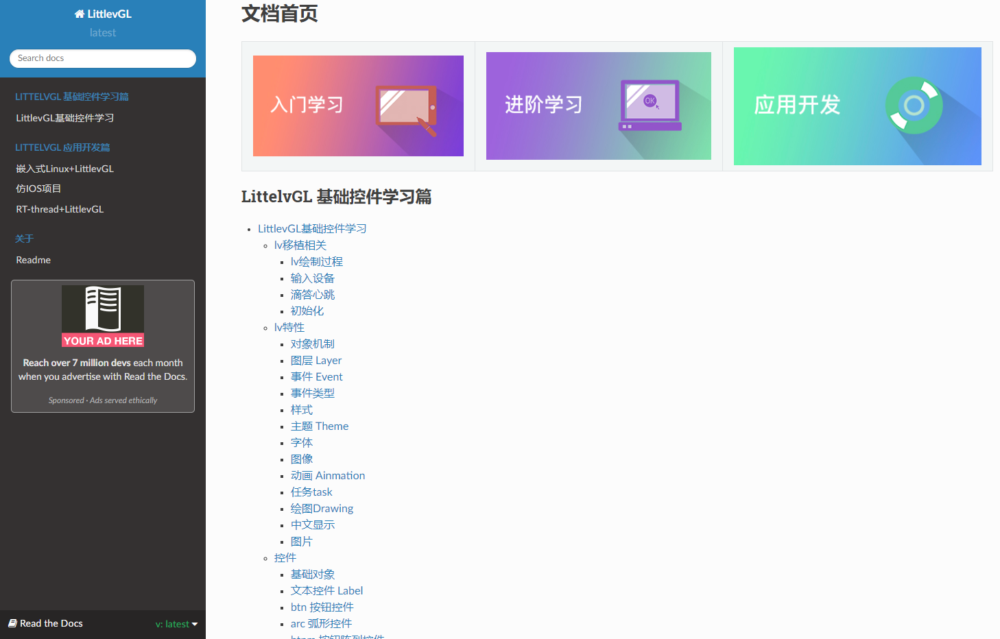

## 硬件平台：

`f1c100s/f1c200s`：800*480分辨率

`gt911`触摸芯片：中断和复位脚定义如下：根据自己情况修改

```c
路径：rt-thread/bsp/allwinner_tina/drivers/drv_touch_gt9xx.c

#define TP_INT_PIN GPIO_PORT_E,GPIO_PIN_10
#define TP_RST_PIN GPIO_PORT_A,GPIO_PIN_0
```

## 运行效果


## 资源下载

```bash
git clone https://gitee.com/tiny200s/lv7_rtthread_f1c100s.git
```

WIN下请使用rtthread官方的ENV工具。自己已经验证。

下面以Linux下开发说明。

## 目录结构说明

### f1c100s_spl

存放f1c100s的bootload源码，编译过程如下:

```bash
cd f1c100s_spl
scons -c
scons

下面是编译输出：最后生成的是 boot.bin 供下载使用
scons: Reading SConscript files ...
scons: done reading SConscript files.
scons: Building targets ...
arm-none-eabi-gcc -o spl/src/sys-clock.o -c -mcpu=arm926ej-s -ffunction-sections -fdata-sections -Wall -O0 -Ispl/src spl/src/sys-clock.c
arm-none-eabi-gcc -o spl/src/sys-copyself.o -c -mcpu=arm926ej-s -ffunction-sections -fdata-sections -Wall -O0 -Ispl/src spl/src/sys-copyself.c
arm-none-eabi-gcc -o spl/src/sys-dram.o -c -mcpu=arm926ej-s -ffunction-sections -fdata-sections -Wall -O0 -Ispl/src spl/src/sys-dram.c
arm-none-eabi-gcc -o spl/src/sys-spi-flash.o -c -mcpu=arm926ej-s -ffunction-sections -fdata-sections -Wall -O0 -Ispl/src spl/src/sys-spi-flash.c
arm-none-eabi-gcc -o spl/src/sys-uart.o -c -mcpu=arm926ej-s -ffunction-sections -fdata-sections -Wall -O0 -Ispl/src spl/src/sys-uart.c
arm-none-eabi-gcc -mcpu=arm926ej-s -ffunction-sections -fdata-sections -c -x assembler-with-cpp -Ispl/src -c -o spl/src/start.o spl/src/start.S
arm-none-eabi-g++ -o spl/spl.elf -mcpu=arm926ej-s -ffunction-sections -fdata-sections -nostartfiles -Wl,--gc-sections,-Map=boot.map,-cref -Tspl/link.ld spl/src/sys-clock.o spl/src/sys-copyself.o spl/src/sys-dram.o spl/src/sys-spi-flash.o spl/src/sys-uart.o spl/src/start.o
arm-none-eabi-objdump -D -S spl/spl.elf > boot.asm
arm-none-eabi-objcopy -O binary spl/spl.elf boot.bin
arm-none-eabi-size spl/spl.elf
   text    data     bss     dec     hex filename
  10237       0  524288  534525   827fd spl/spl.elf
./mksunxi/mksunxi boot.bin
The bootloader head has been fixed, spl size is 10240 bytes.
scons: done building targets.

```

### rt-thread

rt-thread的源代码，编译过程如下：

```bash
cd rt-thread/bsp/allwinner_tina
scons -c
scons

最终生成 rtthread.bin文件
```

### rt-thread/bsp/allwinner_tina/littlevGL7.1.0

存放littlevGL源码，都是从官网git下来的littlevGL7.1.0版本。

```bash

cd rt-thread/bsp/allwinner_tina/littlevGL7.1.0$ ls
Kconfig  lv_conf.h  lv_drivers  lv_examples  lvgl  lv_rtt_port.c  lv_rtt_port.h  SConscript
```

 

### tools/gcc-arm-none-eabi

存放自己的交叉编译工具，由于文件比较大，从网上自己下载放到这个目录即可。不知道怎么操作请issuess。

### tools/sunxi-tools

存放f1c100s的烧录工具，编译过程如下：

```bash
make clean
make

最总会生成 sunxi-fel 工具供我们使用
```

## 烧录

```bash
cd rt-thread/bsp/allwinner_tina
sudo sh script/linux/dram_exec.sh  		# 烧录到ram运行,不需要重启，直接运行
或者
sudo sh script/linux/write_spiflash.sh  # 烧录到spiflash运行,烧录完重启

```

## 声明

感谢https://whycan.cn/index.html提供交流平台

感谢坑网网友提供基础工程https://gitee.com/zhangheyang/f1c100s_rt-thread.git

## 关于

学习littlevGL，在线笔记记录网址：https://littlevgl.readthedocs.io/en/latest/

内容参考网友兔老板教程，不做商用用途，仅仅学习使用。

荔枝派Nano填坑指南和在Linux开发指南参考文档

[https://littlevgl.readthedocs.io/en/latest/Doc/05.%E8%8D%94%E6%9E%9D%E6%B4%BENano/F1C100S.html#id1](https://littlevgl.readthedocs.io/en/latest/Doc/05.荔枝派Nano/F1C100S.html#id1)




荔枝派Nano Linux采坑过程笔记：在线笔记记录网址：https://littlevgl.readthedocs.io/en/latest/


## 联系

交流群：913307302

以上所有文档不得用于行业用途，仅供学习。保留权利。

